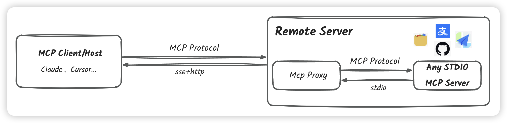
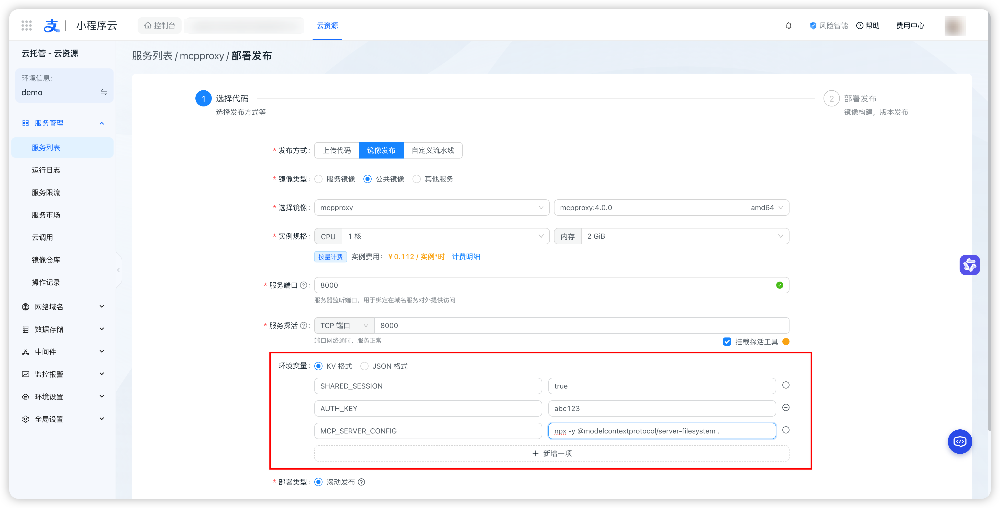

# MCP SSE 代理服务器

<p align="center">
  
</p>

MCP SSE 代理服务器是一个基于 Server-Sent Events (SSE) 的 Model Context Protocol (MCP) 代理服务器，支持使用标准 MCP 协议远程执行 MCP 服务器。支持共享会话和独立会话两种模式。

> 模型上下文协议（Model Context Protocol，MCP）是一个开放协议，用于标准化应用程序如何为 LLM 提供上下文。可以将 MCP 想象成 AI 应用程序的 USB-C 接口。就像 USB-C 为设备连接各种外设和配件提供标准化方式一样，MCP 为 AI 模型连接不同的数据源和工具提供了标准化方式。
>
> 了解更多关于 MCP 的信息：
> - [MCP 文档（中文）](https://docs.mcpservers.cn/introduction)
> - [MCP Documentation (English)](https://modelcontextprotocol.io/introduction)
> - [MCP 服务器库](https://mcpservers.cn/) - 发现和探索各种 MCP 服务器

[English Documentation](README.md)

## 解决什么问题？

本项目允许您：
- 使用标准 MCP 协议在远程启动和交互任何 MCP 服务器
- 通过 SSE 保持稳定的长连接
- 支持多个客户端共享单个 MCP 会话或维护独立会话
- 通过请求参数动态配置服务器环境
- 支持通过 NPX 和 UVX 快速部署 STDIO 进程

## 系统架构

<p align="center">
  
</p>

## 功能特点

- 支持 SSE 长连接，实现服务器推送
- 支持 JSON-RPC 2.0 消息格式
- 提供共享会话和独立会话两种模式
- 支持通过请求参数动态配置会话环境
- 自动保持连接活跃（30秒心跳）
- 完整的错误处理和日志记录
- 内置支持 NPX 和 UVX STDIO 进程部署

## 集成与定制

### 自定义 Docker 镜像

MCP SSE 代理服务器设计了高度的可集成性，可以灵活地集成到各种自定义 Docker 镜像中。这使得您能够为不同的使用场景创建专门的环境：

- **浏览器自动化**：集成 Chrome/Chromium 用于浏览器相关的 MCP 服务器
- **数据库操作**：打包特定数据库用于数据处理的 MCP 服务器
- **开发工具**：集成开发工具用于代码相关的 MCP 服务器
- **AI/ML 工具**：包含 AI/ML 库用于机器学习的 MCP 服务器

### 高级路由

虽然默认配置通过环境变量加载 MCP 服务器命令，但您可以通过以下方式扩展功能：

1. **多服务器集成**：通过配置文件集成多个 MCP 服务器
2. **动态路由**：在 SSE 连接中添加路由字段，将流量导向不同的 MCP 服务器
3. **自定义路由器**：基于此实现构建您自己的 MCP 路由器项目

这种灵活性使您能够：
- 创建专门的 MCP 服务器集群
- 实现多服务器间的负载均衡
- 根据需求设计自定义路由逻辑
- 构建层次化的 MCP 服务器架构

## 配置

### 环境变量

- `SHARED_SESSION`: 控制会话模式
  - `true`: 共享会话模式（默认），所有客户端共享一个 MCP 会话
  - `false`: 独立会话模式，每个客户端创建独立的 MCP 会话

- `AUTH_KEY`: 服务器访问密钥
  - 如果设置，所有请求都需要提供此密钥
  - 通过 URL 参数 `auth_key` 传递

- `MCP_SERVER_CONFIG`: MCP 服务器配置
  示例：
  ```bash
  # 使用 NPX 运行基于 Node.js 的 MCP 服务器
  MCP_SERVER_CONFIG="npx -y @modelcontextprotocol/server-filesystem ."
  
  # 使用 UVX 运行基于 Python 的 MCP 服务器
  MCP_SERVER_CONFIG="uvx mcp-server-fetch"
  ```

### 动态配置

在独立会话模式下（`SHARED_SESSION=false`），每个 SSE 连接会启动一个新的 MCP 服务器进程。你可以通过 URL 参数为每个会话动态配置环境变量：

```
GET /sse?auth_key=xxx&[CUSTOM_ENV]=value
```

这种机制特别适合需要用户特定凭证的场景。例如，部署 GitHub MCP 服务器时，可以让不同用户使用自己的 Personal Access Token：

1. 部署服务器时配置基础命令：
```bash
export MCP_SERVER_CONFIG="npx -y @modelcontextprotocol/server-github"
```

2. 用户连接时通过 URL 传入自己的 token：
```
GET /sse?auth_key=xxx&GITHUB_PERSONAL_ACCESS_TOKEN=ghp_xxxxxxxxxxxx
```

这样，你只需要部署一个 MCP 代理服务器，就能服务多个用户，每个用户使用自己的 GitHub 凭证。其他支持的环境变量配置：

- 通用配置：
  - `NODE_ENV`: Node.js 环境（development/production）
  - `DEBUG`: 调试日志级别
  
- 特定服务器配置：
  - GitHub MCP 服务器：`GITHUB_PERSONAL_ACCESS_TOKEN`
  - 文件系统 MCP 服务器：`ROOT_DIR`
  - 其他服务器特定的环境变量

注意：URL 参数中的环境变量会覆盖服务器默认配置的环境变量。

## API 端点

### SSE 连接
```
GET /sse?auth_key=xxx
```

成功建立连接后，服务器会返回消息端点 URL：
```
event: endpoint
data: /messages?session_id=<session_id>
```

### 消息发送
```
POST /messages?session_id=<session_id>
Content-Type: application/json

{
    "jsonrpc": "2.0",
    "method": "method_name",
    "params": {},
    "id": 1
}
```

## 支持的方法

- `initialize`: 初始化会话
- `tools/list`: 列出可用工具
- `tools/call`: 调用工具
- `prompts/list`: 列出可用提示
- `prompts/get`: 获取提示
- `resources/list`: 列出资源
- `resources/templates/list`: 列出资源模板
- `resources/read`: 读取资源
- `resources/subscribe`: 订阅资源
- `resources/unsubscribe`: 取消订阅资源

## 运行服务器

### 使用 Python

```bash
# 设置环境变量
export AUTH_KEY=your_key
export SHARED_SESSION=true  # 或 false

# 启动服务器
python main.py
```

服务器默认在 `0.0.0.0:8000` 启动。

### 使用 Docker

1. 拉取 Docker 镜像：
```bash
docker pull codefriday123/mcpproxy:1.0
```

2. 运行容器：
```bash
docker run -d \
  -p 8000:8000 \
  -e AUTH_KEY=your_key \
  -e SHARED_SESSION=true \
  -e MCP_SERVER_CONFIG="npx -y @modelcontextprotocol/server-filesystem ." \
  codefriday123/mcpproxy:1.0
```

环境变量说明：
- `AUTH_KEY`: 服务器访问密钥（必需）
- `SHARED_SESSION`: 会话模式（默认：true）
- `MCP_SERVER_CONFIG`: MCP 服务器配置命令

服务器将在 `http://localhost:8000` 可用。

### 使用支付宝云托管

你也可以在[支付宝云托管](https://cloud.alipay.com/)上部署服务器（新人可免费使用容器资源）：

<p align="center">
  
</p>

1. 在云托管中创建新服务
2. 配置服务参数：
   - 镜像：`codefriday123/mcpproxy:1.0`
   - 端口：`8000`
   - 环境变量：
     - `AUTH_KEY`: 你的服务器访问密钥
     - `SHARED_SESSION`: true/false
     - `MCP_SERVER_CONFIG`: 你的 MCP 服务器配置

3. 部署服务

服务器将在云托管提供的端点上可用。

## 日志记录

服务器使用 Python 的 logging 模块记录详细日志，包括：
- 环境变量信息
- 连接建立和关闭
- 消息处理
- 错误和异常

## 错误处理

服务器使用标准的 JSON-RPC 2.0 错误响应格式：
```json
{
    "jsonrpc": "2.0",
    "error": {
        "code": error_code,
        "message": "error message"
    },
    "id": null
}
```

主要错误代码：
- `-32700`: 解析错误
- `-32600`: 无效请求
- `-32601`: 方法未找到
- `-32602`: 无效参数
- `-32603`: 内部错误
- `-32000`: 服务器错误

## 使用示例

### Python 客户端

你可以使用官方 MCP Python 客户端连接到已部署的 MCP 服务器：

```python
import asyncio
from typing import Optional
from contextlib import AsyncExitStack
from mcp import ClientSession, LoggingLevel
from mcp.client.sse import sse_client

class MCPClient:
    def __init__(self):
        self.session: Optional[ClientSession] = None
        self._streams_context = None
        self._session_context = None
        self.exit_stack = AsyncExitStack()

    async def connect_to_sse_server(self, server_url: str):
        """连接到运行 SSE 传输的 MCP 服务器"""
        try:
            print(f"正在连接 {server_url}...")
            self._streams_context = sse_client(url=server_url)
            streams = await self._streams_context.__aenter__()
            self._session_context = ClientSession(*streams)
            self.session = await self._session_context.__aenter__()
            
            try:
                await asyncio.wait_for(self.session.initialize(), timeout=30.0)
                print("会话初始化成功")
            except asyncio.TimeoutError:
                print("会话初始化超时，但将继续执行")

        except Exception as e:
            print(f"连接错误: {e}")
            await self.cleanup()
            raise

    async def cleanup(self):
        """正确清理会话和流"""
        try:
            if hasattr(self, '_session_context') and self._session_context:
                await self._session_context.__aexit__(None, None, None)
            if hasattr(self, '_streams_context') and self._streams_context:
                await self._streams_context.__aexit__(None, None, None)
        except Exception as e:
            print(f"清理错误: {e}")

async def main():
    client = MCPClient()
    try:
        await client.connect_to_sse_server('http://your-server:8000/sse?auth_key=your_auth_key')
        response = await asyncio.wait_for(client.session.list_tools(), timeout=10.0)
        print(f"可用工具: {[tool.name for tool in response.tools]}")
    except Exception as e:
        print(f"错误: {e}")
    finally:
        await client.cleanup()

if __name__ == "__main__":
    asyncio.run(main())
```

### Cursor 集成

你还可以通过将服务器添加到 Cursor 的 MCP 配置中来与 [Cursor](https://docs.cursor.com/context/model-context-protocol) 集成：

```json
{
  "mcpServers": {
    "server-name": {
      "url": "http://your-server:8000/sse?auth_key=your_auth_key",
      "env": {
      }
    }
  }
}
```

将此配置放置在以下位置之一：
- 项目目录中的 `.cursor/mcp.json`，用于项目特定访问
- 主目录中的 `~/.cursor/mcp.json`，用于全局访问

## 许可证

MIT License

## 贡献

欢迎贡献！请随时提交 Pull Request。

## 路线图

### 当前功能
- 基础 MCP 服务器代理功能
- SSE 传输支持
- 共享和独立会话模式
- 动态环境配置
- 与 Cursor 和其他 MCP 客户端的集成

### 未来计划
- **无状态架构**
  - 纯工具模式的无状态操作
  - 基于 HTTP 的工具执行，无需会话管理
  - 简化的部署和扩展
  - 降低资源开销
  - 提高可靠性和可维护性

- **Agent 沙箱**
  - 创建隔离环境运行 MCP agent
  - 资源限制和监控
  - 不可信 agent 的安全沙箱
  - agent 执行的性能优化
  - 流式 HTTP 支持
    - 向前兼容流式 HTTP 协议
    - 混合模式：SSE + HTTP 提供更灵活的方案
    - 协议协商和回退机制
    - 优化的流式性能

- **Agent 路由器**
  - 多个 MCP 服务器之间的智能路由
  - 负载均衡和故障转移
  - 请求/响应转换
  - 协议版本兼容性处理
  - 高级路由规则和策略

- **最佳实践**
  - 不同场景的部署指南
  - 安全建议
  - 性能优化技巧
  - 监控和日志记录最佳实践
  - 与各种 MCP 服务器的集成模式

敬请期待更新和新功能！ 